# Quick Start Guide: Secure Cloud Connectivity and Voice Control Demo for Microchip WFI32-IoT Board .

Devices: **| PIC32 WFI32E | WFI32 | Trust\&Go (ECC608) |**

Features: **| Secure Cloud Connectivity | Voice Control |**

 
 
## Table of Contents

1. [Chapter1: Overview](#chapter1)
	1. 	[1.1 Board Layout](#chapter1.1)
	2.	[1.2 LED Indicators](#chapter1.2)
	3.	[1.3 Switch Button Use Cases](#chapter1.3)
2. [Chapter 2: Getting Started](#chapter2)
	1.	[2.1 Connecting the Board to the Host PC](#chapter2.1)
	3.	[2.2 Connecting the Board to Wi-Fi Networks](#chapter2.2)
		1. 	[2.2.1 Via WFI32-IoT Web page](#chapter2.2.1)
		2. 	[2.2.2 Via Soft AP](#chapter2.2.2)
	4.	[2.3 Visualizing Cloud Data in Real Time](#chapter2.3)
	5.	[2.4 Voice Control](#chapter2.4)

## Chapter 1: Overview 

### 1.1 Board Layout 
The WFI32-IoT board layout can be seen below.

### 1.2 LED Indicators 

* **BLUE - Wi-Fi indicator**
	* **Solid**: Wi-Fi Network Connection | Indicates a successful connection to the local Wi-Fi network.
	* **Blinking**: Soft AP Mode | Indicates that the board can be detected and used as a Wi-Fi access point. For details refer to the 2.3 section.
* **GREEN - Connection indicator** 
	* **Solid**: AWS Cloud Connection | Indicates a successful connection to the AWS Cloud.
	* **Blinking**: Default Wi-Fi credentials | Indicates that the board is trying to establish a Wi-Fi connection using the default credentials.
* **YELLOW - DATA indicator**
	* **Blinking**: Data Publication to the Cloud | Indicates that sensor data in the form of MQTT packet has been successfully published to the AWS Cloud.
	* **Solid for extended time**: State of Toggle sent within MQTT publish packet | Indicates the state of the “Toggle” switch, received as part of the packet published by AWS cloud on the subscribed topic.
* **RED - ERROR** 
	* **Solid**: Error Status | Indicates an error in the application.

### 1.3 Switch Button Use Cases 
* **SW0** held: Enter Soft AP mode
* **SW0 & SW1** held: Use default Wi-Fi credentials {**MCHP.IOT, microchip**}

---

## Chapter 2: Getting Started 

### 2.1 Connecting the Board to the Host PC 
1. The WFI32-IoT can be connected to a computer using a standard micro-USB cable. 
2. Once plugged in, the LED array will blink in the following order twice: **BLUE -> GREEN -> YELLOW -> RED**. 
3. When the board is not connected to Wi-Fi, the **RED LED** will light up.
4. The board will appear as a removable storage device on the host PC
5. Double-click on the **CLICK-ME.HTM** file to go to the demo webpage.

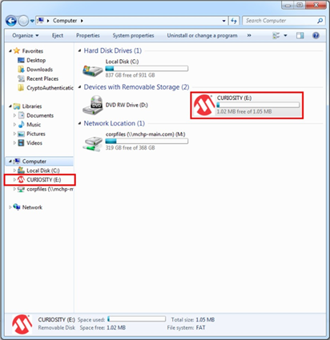

### 2.2 Connecting the Board to Wi-Fi Networks 

#### 2.2.1 Via WFI32-IoT Webpage 
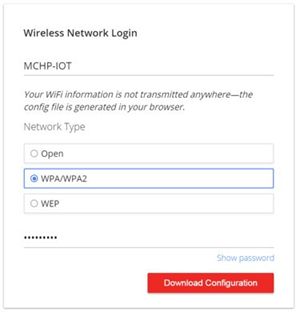

1. The lower left-hand corner of the web page will show a wireless network connection window.
2. Once the required details are entered, click the **Download Configuration** button. 
3. A file named **WIFI.CFG** (text) file is downloaded to the host PC. 
4. Drag and drop the file to the **CURIOSITY drive** to update the Wi-Fi credentials of the board.
5. Reboot the device.
6. The **BLUE LED** will light up once a successful connection to the Wi-Fi Access Point is made.

**Important**: The Wi-Fi network SSID and password are limited to 19 characters. Avoid using quotation marks, names, or phrases that begin or end in spaces. The WFI32-IoT board supports only 2.4 GHz networks inline, thus using mobile hotspots to connect the board to the Internet is recommended.

**Note**: Any information entered in the SSID and password fields is not transmitted over the web or to the Microchip or AWS servers. Instead, the information is used locally (within the browser) to generate the WIFI.CFG file.
 
#### 2.2.2 Via Soft AP 
1. Download **Microchip Wi-Fi provisioning Mobile application** for Android here and for iOS here to your Mobile phone or Tablet.
2. The Soft AP mode can be entered by pressing and holding the **SW0** push button for most of the power up time. 
3. The **BLUE LED** will blink when Soft AP is available.
4. The board can be detected as a Wi-Fi access point named **WFI32-IoT_<MAC_ADDRESS>**. 
5. Using the Mobile phone or tablet, connect to the **WFI32-IoT_<MAC_ADDRESS>** hotspot. 

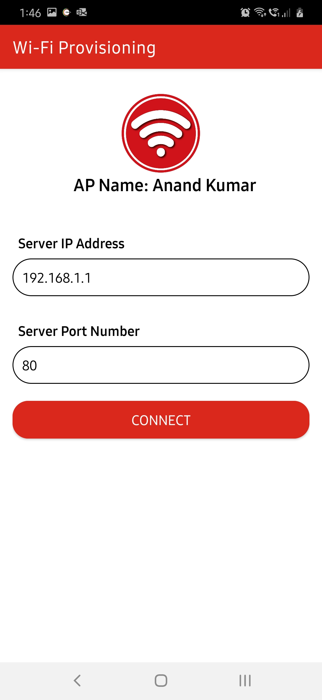

6. List of available APs is shown and you can press **SCAN** button to refresh.
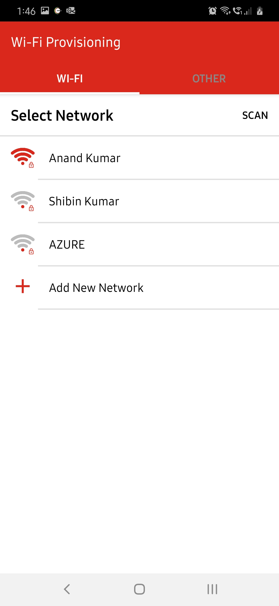

7. You can chose one of the scanned APs or provide your own AP crednetials. Provided credentials are sent to the WFI32-IoT board as you press **SEND**. 

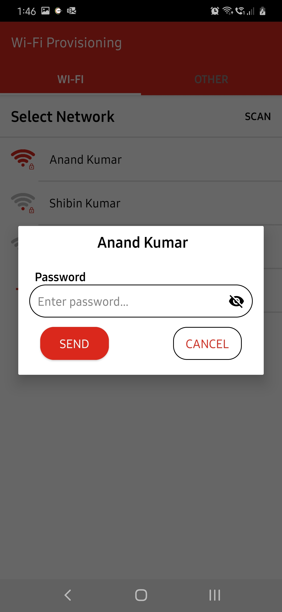
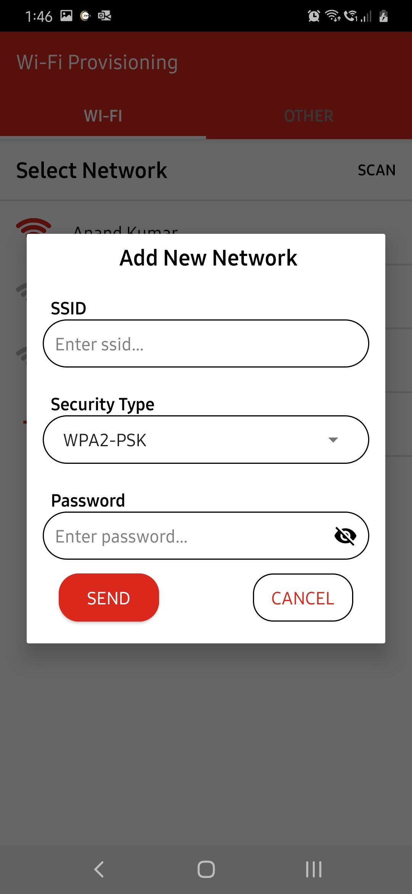

8. Once you go back in the app, WFI32-IoT board will apply new credentilas.
9. The **BLUE LED** will light up once a successful connection to the Wi-Fi Access Point is made.

### 2.3 Visualizing Cloud Data in Real Time 

#### Viewing the published messages
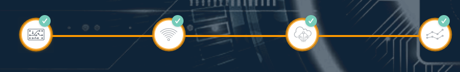

1. After connecting to an access point, WFI32-IoT board will try to connect to AWS cloud Miicrochip Sandbox account which is indicated by a **blinking GREEN LED**.
2. Once connection to cloud is successful, **GREEN LED** will turn solid.
3. Go to demo webpage (can always be reached out using the file **CLICK-ME.HTM**).
4. The webpage will show a real-time graph of the data captured from the on-board light and temperature sensors.
5. The on board **YELLOW LED** will blink for 500ms for each message published successfully to te cloud.

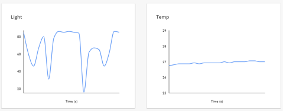

#### Sending messages to the board
1. Click on **What's Next** button below the Temprature and Light graphs.
2. Select **Implement a Cloud-Controlled Actuator** to demostrate cloud performed behaviors.

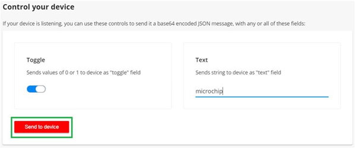

3. Click on **Learn More** button to expand page interface then Scroll to the bottom of **Step 5** where a panel will read **Control Your Device**.

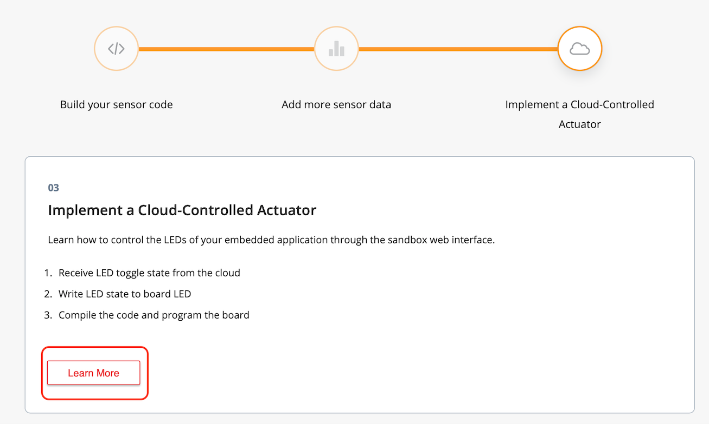

4. By default only a **Toggle** feature is demostrated. Custome implmentations are described further on above the panel.

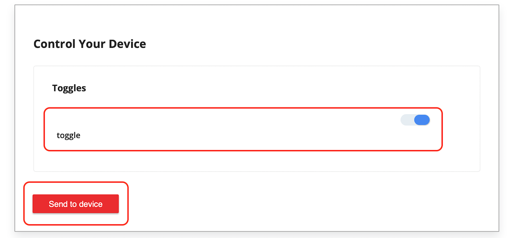

5. Click on **Send to device** to send **Toggle** button value. 
6. When **Toggle** button is selected, the **YELLOW LED** will remain on for 3 Seconds. When unselected, the **YELLOW LED** will remain off for 3 Seconds. After the 3 seocnds, the **YELLOW LED** will go back to its normal functionality; blinking on each successfull message published to the cloud.

**Note**: Because Toggle manipulates the desired stat, the state must be changed to observe the behavior.

### 2.4 Voice Control 
Please note that supported browsers inlcudes Google Chrome, Mozilla Firefox, Safari, and Microsoft Edge while Internet Explorer is not supported. Please also note that only devices registered to the Microchip Cloud account can be registered for voice control and controlled via the voice skills. In case of registration errors, please contact [Microchip support](http://microchip.com/support)

1. Create an account and log-in to the [device registration page](https://microchiptech.github.io/mchpiotvoice/). You can also reach out to this page using the file **VOICE.HTM** on the MSD.
2. Enter your thing name and a friendly name and claim your device by registering it. Thing name can be found at the top of the demo web page just above the temperature graph
3. Successfully claimed devices will show up in the device listing in the left side panel.
4. Using Amazon Alexa® app, enable the skill '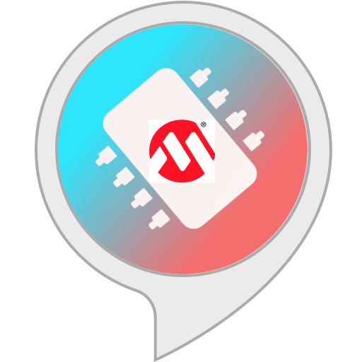 [Microchip IoT](https://www.amazon.com/gp/product/B08B5THZH5?ref&ref=cm_sw_em_r_as_dp_iuhtblwcTlYL4)' and add the dev board as a smart home device.   
5. You can now control the on-board **YELLOW LED** with voice commands using the friendly name provided while claiming the device earlier:
> Alexa, turn on the light
6. The **YELLOW LED** will remain on/off for 3 Seconds based on the voice command.
   
 **Note**: You can find out more information about connecting a smart home device to Alexa from [this link](http://tinyurl.com/alexa-smart-home)
 
 **Note**: Supported browsers inlcude Google Chrome, Mozilla Firefox, Safari, and Microsoft Edge while Internet Explorer is not supported. 
 
 **Note**: Only devices registered to the Microchip Cloud account can be registered for voice control and controlled via the voice skills. In case of registration errors, please contact [Microchip support](http://microchip.com/support)
