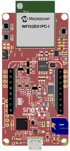

# Application Deep Dive: Secure Cloud Connectivity and Voice Control Demo for Microchip WFI32-IoT Board .

Devices: **| PIC32 WFI32E | WFI32 | Trust\&Go (ECC608) |**

Features: **| Secure Cloud connectivity | Voice Control |**

[](https://github.com/MicrochipTech/PIC32MZW1_Curiosity_OOB/releases/latest)
[](https://github.com/MicrochipTech/PIC32MZW1_Curiosity_OOB/releases/latest)

The WFI32-IoT board comes pre-programmed and configured for demonstrating the connectivity to the AWS Cloud IoT Core.

<p align="center">

</p>
 
## Table of Contents

1. [Chapter 1: Requirements](#chapter1)
2. [Chapter 2: Application Scope](#chapter2)
3. [Chapter 3: Application Description](#chapter3)
4. [Chapter 4: Secure Provisioning & Transport Layer Security](#chapter4)
5. [Chapter 5: Understanding the Device Shadow in AWS ](#chapter5)
6. [Chapter 6: Detailed operation](#chapter6)
 
## Chapter 1: Requirements <a name="Chapter1"></a>

* **MPLAB® X Integrated Development Environment (IDE) v5.40 or later**
MPLAB® X IDE is a computer software program based on the open source NetBeans IDE from Oracle. It is used to develop applications for Microchip microcontrollers and digital signal controllers. It runs on Windows®, Mac OS® and Linux®. 
For the latest version, please refer to: [MPLAB-X](https://www.microchip.com/mplab/mplab-x-ide)

* **MPLAB® XC32 Compiler v2.41 or later**
MPLAB® XC compilers support all of Microchip’s PIC, AVR and dsPIC devices where the code is written in the C programming language. XC32 is the recommended compiler for 32-bit PIC MCUs. In this lab, as well as with the succeeding labs, you will be using MPLAB® XC32 for an PIC MCU.
For the latest version, please refer to: [XC-Compiler](https://www.microchip.com/mplab/compilers)

* **WFI32-IoT Board**
The WFI32-IoT board is a compact, easy-to-use development board that supports rapid prototyping of IoT devices and demonstrates cloud connectivity with voice control enablement. This kit is also a useful tool to evaluate the features of WFI32E01PC, the single-chip Wi-Fi module. The board also includes an on-board debugger and requires no external hardware to program and debug the MCU.

---

## Chapter 2: Application Scope <a name="Chapter2"></a>
The WFI32-IoT-IoT development board has been created with the intention of demostrating a one source solution for evaluation of existing cloud provider solutions. 
This example end-device leverages the catalog of devices, and libraries provided through Microchip's extensive product line to showcase a basic Internet of Things product connection. Data exchange between server and in field device is implemented using on board sensors for temperature and light value observations. Behavior actions are demonstrated through visual indication of the 'Data' LED as controlled through the Web based APIs. 

General Out-Of-Box operation is as described below:
1. Use the WFI32E01PC single-chip WiFi module to establish local WiFi connection to Router/Switch or Network source. The **Blue 'Wi-Fi' LED** is used to indicate this status. 
2. The on-chip ECC608 HSM is used to establishe a Secure (TLS) Socket Connection with select Cloud Provider using a TCP connection. The **Green 'Connect' LED** is used to indicate this status
3. Using AWS C SDK V4.0, data is exchanged between client (end-device) and broker (cloud). 
4. Sensor Data is sent as Telemetry Data between device and broker at a periodic rate of 1 Second. The **Yellow 'Data' LED** blinks to indicate this status. 
5. Capture of Data sent from Broker to Device can be observed through a Serial terminal when USB-Micro is connected to WFI32-IoT board. 
6. Behavior variation can be observed on the 'Data' LED when triggered through the web based API and sent through the broker to end device.

**Note**:The **SW0 & SW1** user buttons have no effect outside of variation of start-up operation where:
	* **SW0** held: Enter Soft AP mode.
	* **SW0 & SW1** held: Use default Wi-Fi credentials {**MCHP.IOT, microchip**}

**Note**: The **Red 'Data' LED** remaining on may indicate a hardware fault or a non connected Wi-Fi.

---

## Chapter 3: Application Description <a name="Chapter3"></a>

### AWS Cloud
1. Publish payload for sensor data (telemetry)
	* topic: ``<thingName>/sensors ``
	* payload: 
	```json
	{
	  "Light": lightValue,
	  "Temp": temperatureValue
	} 
	```
2. Device publishes payload to update the Device Shadow
      * topic: ``$aws/things/<thingName>/shadow/update``
      * payload:
	```json
	{
	  "state":
	  {
	       "reported":
	       {
		    "toggle": updatedToggleValue
	       }
	  }
	}
     ```
3. Web Interface publishes payload to Device Shadow
      * topic: ``$aws/things/<thingName>/shadow/update``
      * payload:
	```json
	{
	  "state":
	  {
	       "desired":
	       {
		     "toggle": toBeUpdatedToggleValue
	       }
	  }
	}
	```
4. Device subscribes to delta to receive actionable changes
      * topic: ``$aws/things/<thingName>/shadow/update/delta``
      * payload:  
	```json
	{
	   "state":
	  {
	       "Light": lightValue,
	  }
	}
	```

The PIC IoT development board publishes data from the on-board light and temperature sensor every 1 second to the cloud.
The data received over the subscribed topic is displayed on a serial terminal.

### Sending MQTT publish packets  
+ The C code for sending MQTT publish packets is available in PICIoT.X/mcc_generated_files/application_manager.c file.
+ The API ``static void sendToCloud(void)`` is responsible for publishing data at an interval of 1 second.

### Sending MQTT subscribe packets
+ The C code for sending MQTT subscribe packets is available in PICIoT.X/mcc_generated_files/application_manager.c file.
+ The API ``static void subscribeToCloud(void)`` is responsible for sending MQTT subscribe packets to the cloud after MQTT connection is established.

### Processing Packets received over subscribed topic
+ The C code for processing MQTT publish packets received over the subscribed topic is available in PICIoT.X/mcc_generated_files/application_manager.c file.
+ The ``static void receivedFromCloud(uint8_t *topic, uint8_t *payload)`` function is used for processing packets published over the subscribed topic.

---

## Secure Provisioning & Transport Layer Security

1. The PIC-IoT board under the Wireless for Amazon Web Services (WA) variation is shipped pre-provisioned for coordination with the AWS Cloud system.
2. Security is achieved by using the built-in Transport Layer Security (TLS) 'stack' configured within the WINC Wi-Fi Module.
3. A Pre-Manufacturing process has configured the appropriate Slot locations on the ATECC608A security device.
4. All required certificates used for signing and authentication have been written to, and 'locked' into allocated slots.
     + This process is achieved through: [TrustFlex](https://www.microchip.com/design-centers/security-ics/trust-platform/trustflex/trustflex-aws-iot-authentication)
     + Additional options are also supported, such as: [Trust&Go](https://www.microchip.com/design-centers/security-ics/trust-platform/trust-go)
     + Fully scope of support for Secure Aspects of development can be found here: [Trust Platform](https://www.microchip.com/design-centers/security-ics/trust-platform)
5. This process has been performed to allow for an Out Of Box (OOB) operation of the PIC-IoT development board along with supporting web page.
6. Shadow Topic are a key application feature being supported through the AWS platform. Further reference can be found here:
     + [Shadow MQTT Topics](https://docs.aws.amazon.com/iot/latest/developerguide/device-shadow-mqtt.html)
7. For PIC-IoT development not provisioned for the AWS platform; refer to the below repo location:
     + **gitHub Provisioning Repo coming in future. Currently refer to:**
     + [AVR-IoT AWS Provisioning](https://www.microchip.com/wwwAppNotes/AppNotes.aspx?appnote=en611265)

---

## Understanding the Device Shadow in AWS 

  1. The AWS broker allows for the use of Shadow Topics. The Shadow Topics are used to retain a specific value within the Broker, so End-Device status updates can be managed.
     + Shadow Topics are used to restore the state of variables, or applications.
     + Shadow Topics retain expected values, and report if Published data reflects a difference in value.
     + When difference exist, status of the delta is reported to those subscribed to appropriate topic messages.
  
     
	 
  2. Updates to the device shadow are published on $aws/things/{ThingName}/shadow/update topic. 
     When a message is sent to the board by changing the value of the **toggle** fiels in **Control Your Device** section:
	 + This message is published on the $aws/things/{ThingName}/shadow/update topic. 
	 + If the curent value of **toggle** in the device shadow is different from the **toggle** value present in the AWS Device Shadow, the AWS Shadow service reports this change to the device by publishing a message on $aws/things/{ThingName}/shadow/update/delta topic.
	 + The JSON structure of the message sent should appear as below
	   ```json
        {
          "state": {
            "desired": {
              "toggle": [value]
            }
          }
        }
        ```
		
   3. The meta data, and delta difference will be reported via the Serial Terminal upon a difference between desired/reported.
	
      
	 
   4. In response to this, the end device publishes a message to $aws/things/{ThingName}/shadow/update topic.
      + This message is published to **report** the update to the **toggle** attribute.
	  + The JSON structure of the message sent should appear as below
	   ```json
        {
          "state": {
            "reported": {
              "toggle": [value]
            }
          }
        }
        ```
	
   5. Application flow when using the device shadow 	
	
      
	 
 ---

### Detailed Operation
  0. There are three possible variations within application behavior possible by holding push buttons on startup
     + Default behavior: No Button Pressed
     + Soft AP: SW0 is Held on startup (see description farther in document)
     + Default behavior Restore DEFAULT Credentials: SW0 & SW1 Held on startup. This state is reflected by **BLINKING GREEN LED** until a Wi-Fi connection is established. 
          + After a successful connection; last VALID CREDIENTIALS are maintained in the WINC for next power cycle connection. 

  1. Connect board to PC using USB-micro cable. 

     + The LEDs will **Cycle** upon startup: **BLUE-->GREEN-->YELLOW-->RED**, short delay, **BLUE-->GREEN-->YELLOW-->RED**.

  2. The **BLUE LED** will begin to blink, this indicates the board is attempting to join the local **ACCESS POINT**.

     

  3. Update the Wi-Fi Credentials; upon connecting the blinking will stop, and the **LED** will become **STATIC**. Below are the easiest methods to update credentials.
     + The board will appear on the PC enumerated as a mass storage device under the name **CURIOSITY**. Credentials can be downloaded as the file **WIFI.CFG** using the **CLICK-ME.HTM** file stored on the **CURIOSITY** device.
     
     

     + This will launch the URL: https://pic-iot.com/aws/{ThingName}. 
     + After entering credentials, the **.CFG** file is produced through the web browser. No information is shared through the internet. 
     + Drag and Drop, or Copy and Paste the **WIFI.CFG** file onto the **CURIOSITY** device to load new credentials onto the IoT demonstration board.
	 
     
          
     
     + Use a **Serial Terminal** to update the WiFi Credentials loaded onto the WINC module. Use the Command Line Interface (CLI) supported command ``wifi host_name,pass_code,auth_type`` | host_name/pass_code are entered strings, auth_type is int value: (0: open, 1: WEP, 2: WPA).

     

  4. After becoming connected to the ACCESS POINT, the GREEN LED will begin to blink, this indicates the board is attempting to establish a TCP/IP and MQTT connection with the cloud providing service. The GREEN LED will stop blinking and become STATIC when the TCP and MQTT connection is established.
     + Using the in module TCP/IP stack pre-configured with provisioned credentials; the device establishes a **MQTT** connection with the IoT Broker provider (AWS).
     

  5. After successfully establishing MQTT connection, the **YELLOW LED** will blink, indicating data exchanged between the End-Device (PIC-IoT), and BROKER (AWS). 

     

  6. Connect to the www.avr-iot.com/aws/{thingName}, or www.pic-iot.com/aws/{thingName}, device specific website to view publish/subscribe data. 
     + This page can be found via launching the **CLICK-ME.HTM** file on the **CURIOSITY** device.
     + There will be (2) scrolling graphs visible. (1) shows temperature sensor, (1) shows the light sensor value. 
     + Additional graphs can be produced altered through the published topic message.

     

  7. **Control Your Device** using the (3) rows beneath the '**Control Your Device**' section used to publish subscription data to end-devices through the broker. 
     + **Only the use of Toggle is supported natively**
     + **Expanding features would require custom written Firmware implementation**
     + These example rows demonstrate options for: Toggle (boolean), Text Field (String), Sliders (integer)

     

  8. When connection is established with the Broker, the publish message topic will be printed to a serial terminal through the CDC-USB bridge.
     + 9600 is expected Baud Rate.
     + When a topic subscription is received, the payload is printed in JSON format to the terminal.
     + Topic subscription message are sent when the 'Send to device' push button on the webpage is pressed. 

     

  9. When the 'Desired' state is updated in the 'Delta' Shadow Topic. 
     + Device which required updates to the 'Desired' state which differs from their last 'Reported' value will receieve a published message on the '.../delta' MQTT topic. 
     + Upon reception the device will report the updated 'Desired' value for the attribute with timestamp on the console.

     

